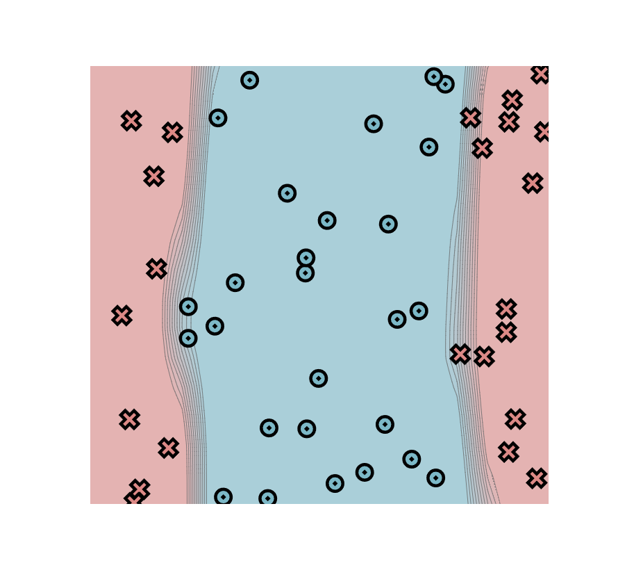
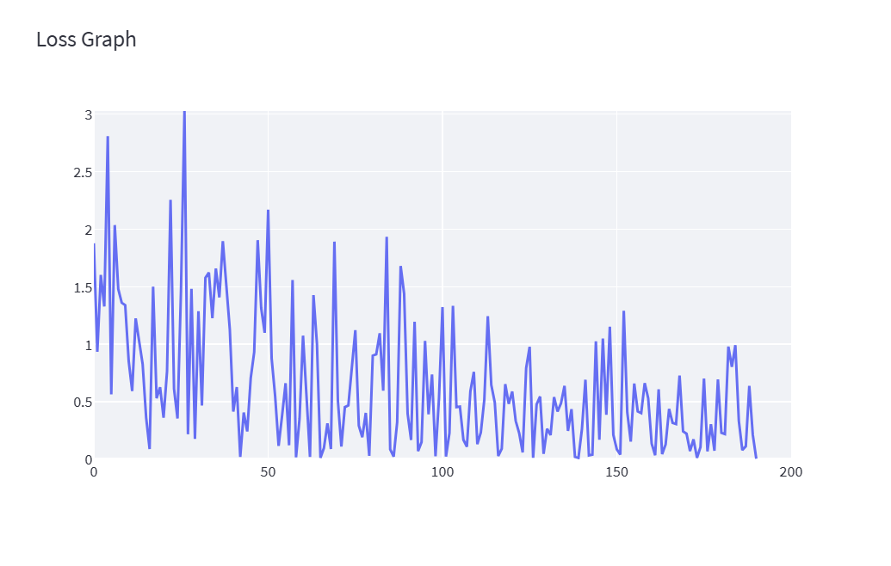

# MiniTorch Module 3


* Docs: https://minitorch.github.io/

* Overview: https://minitorch.github.io/module3.html


You will need to modify `tensor_functions.py` slightly in this assignment.

* Tests:

```
python run_tests.py
```

* Note:

Several of the tests for this assignment will only run if you are on a GPU machine and will not
run on github's test infrastructure. Please follow the instructions to setup up a colab machine
to run these tests.

This assignment requires the following files from the previous assignments. You can get these by running

```bash
python sync_previous_module.py previous-module-dir current-module-dir
```

The files that will be synced are:

        minitorch/tensor_data.py minitorch/tensor_functions.py minitorch/tensor_ops.py minitorch/operators.py minitorch/scalar.py minitorch/scalar_functions.py minitorch/module.py minitorch/autodiff.py minitorch/module.py project/run_manual.py project/run_scalar.py project/run_tensor.py minitorch/operators.py minitorch/module.py minitorch/autodiff.py minitorch/tensor.py minitorch/datasets.py minitorch/testing.py minitorch/optim.py

## Parallel Analytics for Task 3.1 and 3.2
```
MAP

================================================================================
 Parallel Accelerator Optimizing:  Function tensor_map.<locals>._map,
C:\Users\ASUS\Documents\Project\mini-torch\mod3-ethan-yz-
hao\minitorch\fast_ops.py (163)
================================================================================


Parallel loop listing for  Function tensor_map.<locals>._map, C:\Users\ASUS\Documents\Project\mini-torch\mod3-ethan-yz-hao\minitorch\fast_ops.py (163)
-------------------------------------------------------------------------------------------|loop #ID
    def _map(                                                                              |
        out: Storage,                                                                      |
        out_shape: Shape,                                                                  |
        out_strides: Strides,                                                              |
        in_storage: Storage,                                                               |
        in_shape: Shape,                                                                   |
        in_strides: Strides,                                                               |
    ) -> None:                                                                             |
        # TODO: Implement for Task 3.1.                                                    |
        if list(in_shape) == list(out_shape) and list(in_strides) == list(out_strides):    |
            for i in prange(len(out)):-----------------------------------------------------| #0
                out[i] = fn(in_storage[i])                                                 |
        else:                                                                              |
            for i in prange(len(out)):-----------------------------------------------------| #1
                in_i = np.empty(MAX_DIMS, np.int32)                                        |
                out_i = np.empty(MAX_DIMS, np.int32)                                       |
                                                                                           |
                to_index(i, out_shape, out_i)                                              |
                broadcast_index(out_i, out_shape, in_shape, in_i)                          |
                                                                                           |
                out_pos = index_to_position(out_i, out_strides)                            |
                in_pos = index_to_position(in_i, in_strides)                               |
                                                                                           |
                out[out_pos] = fn(in_storage[in_pos])                                      |
--------------------------------- Fusing loops ---------------------------------
Attempting fusion of parallel loops (combines loops with similar properties)...
Following the attempted fusion of parallel for-loops there are 2 parallel for-
loop(s) (originating from loops labelled: #0, #1).
--------------------------------------------------------------------------------
----------------------------- Before Optimisation ------------------------------
--------------------------------------------------------------------------------
------------------------------ After Optimisation ------------------------------
Parallel structure is already optimal.
--------------------------------------------------------------------------------
--------------------------------------------------------------------------------

---------------------------Loop invariant code motion---------------------------
Allocation hoisting:
The memory allocation derived from the instruction at
C:\Users\ASUS\Documents\Project\mini-torch\mod3-ethan-yz-
hao\minitorch\fast_ops.py (177) is hoisted out of the parallel loop labelled #1
(it will be performed before the loop is executed and reused inside the loop):
   Allocation:: in_i = np.empty(MAX_DIMS, np.int32)
    - numpy.empty() is used for the allocation.
The memory allocation derived from the instruction at
C:\Users\ASUS\Documents\Project\mini-torch\mod3-ethan-yz-
hao\minitorch\fast_ops.py (178) is hoisted out of the parallel loop labelled #1
(it will be performed before the loop is executed and reused inside the loop):
   Allocation:: out_i = np.empty(MAX_DIMS, np.int32)
    - numpy.empty() is used for the allocation.
None
ZIP

================================================================================
 Parallel Accelerator Optimizing:  Function tensor_zip.<locals>._zip,
C:\Users\ASUS\Documents\Project\mini-torch\mod3-ethan-yz-
hao\minitorch\fast_ops.py (214)
================================================================================


Parallel loop listing for  Function tensor_zip.<locals>._zip, C:\Users\ASUS\Documents\Project\mini-torch\mod3-ethan-yz-hao\minitorch\fast_ops.py (214)
-----------------------------------------------------------------------------------------------------------------------------|loop #ID
    def _zip(                                                                                                                |
        out: Storage,                                                                                                        |
        out_shape: Shape,                                                                                                    |
        out_strides: Strides,                                                                                                |
        a_storage: Storage,                                                                                                  |
        a_shape: Shape,                                                                                                      |
        a_strides: Strides,                                                                                                  |
        b_storage: Storage,                                                                                                  |
        b_shape: Shape,                                                                                                      |
        b_strides: Strides,                                                                                                  |
    ) -> None:                                                                                                               |
        # TODO: Implement for Task 3.1.                                                                                      |
        if list(a_strides) == list(b_strides) == list(out_strides) and list(a_shape) == list(b_shape) == list(out_shape):    |
            for i in prange(len(out)):---------------------------------------------------------------------------------------| #2
                out[i] = fn(a_storage[i], b_storage[i])                                                                      |
                                                                                                                             |
        else:                                                                                                                |
            for i in prange(len(out)):---------------------------------------------------------------------------------------| #3
                out_i: Index = np.empty(MAX_DIMS, np.int32)                                                                  |
                a_i: Index = np.empty(MAX_DIMS, np.int32)                                                                    |
                b_i: Index = np.empty(MAX_DIMS, np.int32)                                                                    |
                                                                                                                             |
                to_index(i, out_shape, out_i)                                                                                |
                broadcast_index(out_i, out_shape, a_shape, a_i)                                                              |
                broadcast_index(out_i, out_shape, b_shape, b_i)                                                              |
                                                                                                                             |
                out_pos = index_to_position(out_i, out_strides)                                                              |
                a_pos = index_to_position(a_i, a_strides)                                                                    |
                b_pos = index_to_position(b_i, b_strides)                                                                    |
                                                                                                                             |
                out[out_pos] = fn(a_storage[a_pos], b_storage[b_pos])                                                        |
--------------------------------- Fusing loops ---------------------------------
Attempting fusion of parallel loops (combines loops with similar properties)...
Following the attempted fusion of parallel for-loops there are 2 parallel for-
loop(s) (originating from loops labelled: #2, #3).
--------------------------------------------------------------------------------
----------------------------- Before Optimisation ------------------------------
--------------------------------------------------------------------------------
------------------------------ After Optimisation ------------------------------
Parallel structure is already optimal.
--------------------------------------------------------------------------------
--------------------------------------------------------------------------------

---------------------------Loop invariant code motion---------------------------
Allocation hoisting:
The memory allocation derived from the instruction at
C:\Users\ASUS\Documents\Project\mini-torch\mod3-ethan-yz-
hao\minitorch\fast_ops.py (232) is hoisted out of the parallel loop labelled #3
(it will be performed before the loop is executed and reused inside the loop):
   Allocation:: out_i: Index = np.empty(MAX_DIMS, np.int32)
    - numpy.empty() is used for the allocation.
The memory allocation derived from the instruction at
C:\Users\ASUS\Documents\Project\mini-torch\mod3-ethan-yz-
hao\minitorch\fast_ops.py (233) is hoisted out of the parallel loop labelled #3
(it will be performed before the loop is executed and reused inside the loop):
   Allocation:: a_i: Index = np.empty(MAX_DIMS, np.int32)
    - numpy.empty() is used for the allocation.
The memory allocation derived from the instruction at
C:\Users\ASUS\Documents\Project\mini-torch\mod3-ethan-yz-
hao\minitorch\fast_ops.py (234) is hoisted out of the parallel loop labelled #3
(it will be performed before the loop is executed and reused inside the loop):
   Allocation:: b_i: Index = np.empty(MAX_DIMS, np.int32)
    - numpy.empty() is used for the allocation.
None
REDUCE

================================================================================
 Parallel Accelerator Optimizing:  Function tensor_reduce.<locals>._reduce,
C:\Users\ASUS\Documents\Project\mini-torch\mod3-ethan-yz-
hao\minitorch\fast_ops.py (270)
================================================================================


Parallel loop listing for  Function tensor_reduce.<locals>._reduce, C:\Users\ASUS\Documents\Project\mini-torch\mod3-ethan-yz-hao\minitorch\fast_ops.py (270)
---------------------------------------------------------------|loop #ID
    def _reduce(                                               |
        out: Storage,                                          |
        out_shape: Shape,                                      |
        out_strides: Strides,                                  |
        a_storage: Storage,                                    |
        a_shape: Shape,                                        |
        a_strides: Strides,                                    |
        reduce_dim: int,                                       |
    ) -> None:                                                 |
        # TODO: Implement for Task 3.1.                        |
        reduce_size = a_shape[reduce_dim]                      |
        reduce_stride = a_strides[reduce_dim]                  |
        for i in prange(len(out)):-----------------------------| #4
            out_i = np.empty(MAX_DIMS, np.int32)               |
                                                               |
            to_index(i, out_shape, out_i)                      |
                                                               |
            out_pos = index_to_position(out_i, out_strides)    |
            a_pos = index_to_position(out_i, a_strides)        |
                                                               |
            temp = out[out_pos]                                |
            for _ in range(reduce_size):                       |
                temp = fn(temp, a_storage[a_pos])              |
                a_pos += reduce_stride                         |
            out[out_pos] = temp                                |
--------------------------------- Fusing loops ---------------------------------
Attempting fusion of parallel loops (combines loops with similar properties)...
Following the attempted fusion of parallel for-loops there are 1 parallel for-
loop(s) (originating from loops labelled: #4).
--------------------------------------------------------------------------------
----------------------------- Before Optimisation ------------------------------
--------------------------------------------------------------------------------
------------------------------ After Optimisation ------------------------------
Parallel structure is already optimal.
--------------------------------------------------------------------------------
--------------------------------------------------------------------------------

---------------------------Loop invariant code motion---------------------------
Allocation hoisting:
The memory allocation derived from the instruction at
C:\Users\ASUS\Documents\Project\mini-torch\mod3-ethan-yz-
hao\minitorch\fast_ops.py (283) is hoisted out of the parallel loop labelled #4
(it will be performed before the loop is executed and reused inside the loop):
   Allocation:: out_i = np.empty(MAX_DIMS, np.int32)
    - numpy.empty() is used for the allocation.
None
MATRIX MULTIPLY

================================================================================
 Parallel Accelerator Optimizing:  Function _tensor_matrix_multiply,
C:\Users\ASUS\Documents\Project\mini-torch\mod3-ethan-yz-
hao\minitorch\fast_ops.py (299)
================================================================================


Parallel loop listing for  Function _tensor_matrix_multiply, C:\Users\ASUS\Documents\Project\mini-torch\mod3-ethan-yz-hao\minitorch\fast_ops.py (299)
----------------------------------------------------------------------------------------------------------|loop #ID
def _tensor_matrix_multiply(                                                                              |
    out: Storage,                                                                                         |
    out_shape: Shape,                                                                                     |
    out_strides: Strides,                                                                                 |
    a_storage: Storage,                                                                                   |
    a_shape: Shape,                                                                                       |
    a_strides: Strides,                                                                                   |
    b_storage: Storage,                                                                                   |
    b_shape: Shape,                                                                                       |
    b_strides: Strides,                                                                                   |
) -> None:                                                                                                |
    """NUMBA tensor matrix multiply function.                                                             |
                                                                                                          |
    Should work for any tensor shapes that broadcast as long as                                           |
                                                                                                          |
    ```                                                                                                   |
    assert a_shape[-1] == b_shape[-2]                                                                     |
    ```                                                                                                   |
                                                                                                          |
    Optimizations:                                                                                        |
                                                                                                          |
    * Outer loop in parallel                                                                              |
    * No index buffers or function calls                                                                  |
    * Inner loop should have no global writes, 1 multiply.                                                |
                                                                                                          |
                                                                                                          |
    Args:                                                                                                 |
    ----                                                                                                  |
        out (Storage): storage for `out` tensor                                                           |
        out_shape (Shape): shape for `out` tensor                                                         |
        out_strides (Strides): strides for `out` tensor                                                   |
        a_storage (Storage): storage for `a` tensor                                                       |
        a_shape (Shape): shape for `a` tensor                                                             |
        a_strides (Strides): strides for `a` tensor                                                       |
        b_storage (Storage): storage for `b` tensor                                                       |
        b_shape (Shape): shape for `b` tensor                                                             |
        b_strides (Strides): strides for `b` tensor                                                       |
                                                                                                          |
    Returns:                                                                                              |
    -------                                                                                               |
        None : Fills in `out`                                                                             |
                                                                                                          |
    """                                                                                                   |
    a_batch_stride = a_strides[0] if a_shape[0] > 1 else 0                                                |
    b_batch_stride = b_strides[0] if b_shape[0] > 1 else 0                                                |
                                                                                                          |
    # TODO: Implement for Task 3.2.                                                                       |
    row_a = a_strides[2]                                                                                  |
    col_b = b_strides[1]                                                                                  |
    blocks = a_shape[-1]                                                                                  |
                                                                                                          |
    for row_i in prange(0, out_shape[0]):-----------------------------------------------------------------| #5
        for col_j in range(0, out_shape[1]):                                                              |
            for block_k in range(0, out_shape[2]):                                                        |
                row_s = row_i * a_batch_stride + col_j * a_strides[1]                                     |
                col_s = row_i * b_batch_stride + block_k * b_strides[2]                                   |
                                                                                                          |
                temp = 0.0                                                                                |
                for _ in range(0, blocks):                                                                |
                    temp += a_storage[row_s] * b_storage[col_s]                                           |
                    row_s += row_a                                                                        |
                    col_s += col_b                                                                        |
                                                                                                          |
                out[row_i * out_strides[0] + col_j * out_strides[1] + block_k * out_strides[2]] = temp    |
--------------------------------- Fusing loops ---------------------------------
Attempting fusion of parallel loops (combines loops with similar properties)...
Following the attempted fusion of parallel for-loops there are 1 parallel for-
loop(s) (originating from loops labelled: #5).
--------------------------------------------------------------------------------
----------------------------- Before Optimisation ------------------------------
--------------------------------------------------------------------------------
------------------------------ After Optimisation ------------------------------
Parallel structure is already optimal.
--------------------------------------------------------------------------------
--------------------------------------------------------------------------------

---------------------------Loop invariant code motion---------------------------
Allocation hoisting:
No allocation hoisting found
None
```

## Performance Comparison for Task 3.4

The graph outlines the performance of the matrix multiplication on different sizes of matrices between the Fast Tensor Backend and the GPU Backend.


## Training Result on Small Model for Task 3.5

I've treaked `run_fast_tensor.py` to display time per epoch in the console. For CPU Backend, results from the GUI is also reported.

### Split Dataset

GPU Backend, Hidden Size = 100, Rate = 0.05, Epoch = 500

```
Epoch  0  loss  7.20703946624868 correct 29 time per epoch 0.2935986042022705
Epoch  10  loss  5.552066631726721 correct 36 time per epoch 1.4748617172241212
Epoch  20  loss  4.523426777113573 correct 45 time per epoch 1.6664450645446778
Epoch  30  loss  2.8387024684287017 correct 45 time per epoch 1.447551703453064
Epoch  40  loss  2.3149928342510124 correct 45 time per epoch 1.4669385433197022
Epoch  50  loss  2.1979808855940517 correct 45 time per epoch 1.5015981197357178
Epoch  60  loss  2.420640476859975 correct 48 time per epoch 1.508871030807495
Epoch  70  loss  4.223021527654799 correct 48 time per epoch 1.4978782415390015
Epoch  80  loss  1.3423373610439708 correct 48 time per epoch 1.4791741609573363
Epoch  90  loss  1.2774252648037354 correct 47 time per epoch 1.421510934829712
Epoch  100  loss  2.7920123317523386 correct 46 time per epoch 1.4332593441009522
Epoch  110  loss  0.7187003488845782 correct 48 time per epoch 1.4817720651626587
Epoch  120  loss  0.7715618302265982 correct 49 time per epoch 1.475015926361084
Epoch  130  loss  1.2581761037420098 correct 48 time per epoch 1.3926736116409302
Epoch  140  loss  1.6825238287692414 correct 50 time per epoch 1.3435331106185913
Epoch  150  loss  2.693724657571537 correct 49 time per epoch 1.44940288066864
Epoch  160  loss  1.417498018345754 correct 49 time per epoch 1.5292673110961914
Epoch  170  loss  1.5507643600632786 correct 49 time per epoch 1.4643093585968017
Epoch  180  loss  0.4837056388037255 correct 49 time per epoch 1.4190196752548219
Epoch  190  loss  2.367382192672591 correct 46 time per epoch 1.454902982711792
Epoch  200  loss  0.4611941833459433 correct 49 time per epoch 1.4788995027542113
Epoch  210  loss  1.8729282115564148 correct 49 time per epoch 1.4365175485610961
Epoch  220  loss  0.7204055945973245 correct 48 time per epoch 1.3710854530334473
Epoch  230  loss  2.376375193112155 correct 48 time per epoch 1.4091459035873413
Epoch  240  loss  1.7679078151784855 correct 49 time per epoch 1.4453880786895752
Epoch  250  loss  0.8196072014436191 correct 49 time per epoch 1.4751222372055053
Epoch  260  loss  0.5740068984297232 correct 49 time per epoch 1.4408376216888428
Epoch  270  loss  0.22813019962312575 correct 49 time per epoch 1.4527955293655395
Epoch  280  loss  0.06332328877565324 correct 49 time per epoch 1.7732581615447998
Epoch  290  loss  1.0649084071555417 correct 48 time per epoch 1.9146260499954224
Epoch  300  loss  0.4682587869771381 correct 49 time per epoch 1.3499393939971924
Epoch  310  loss  0.41712223529259024 correct 50 time per epoch 1.456479001045227
Epoch  320  loss  0.4484808481744901 correct 50 time per epoch 1.4628466367721558
Epoch  330  loss  0.5606040232364069 correct 49 time per epoch 1.8670769453048706
Epoch  340  loss  1.3577166458448082 correct 48 time per epoch 1.532058095932007
Epoch  350  loss  0.26721699683357725 correct 50 time per epoch 1.4992332220077516
Epoch  360  loss  0.0676774054889719 correct 49 time per epoch 1.5268179655075074
Epoch  370  loss  0.1860302431748332 correct 49 time per epoch 1.655936074256897
Epoch  380  loss  0.28484616586033235 correct 49 time per epoch 1.8555487155914308
Epoch  390  loss  0.7281306352244029 correct 49 time per epoch 1.9155046224594116
Epoch  400  loss  0.24447250883211194 correct 49 time per epoch 1.7601491451263427
Epoch  410  loss  1.3583284287732724 correct 49 time per epoch 1.8458780527114869
Epoch  420  loss  0.09176378435255458 correct 50 time per epoch 1.5605223655700684
Epoch  430  loss  0.02370071027017839 correct 50 time per epoch 1.545343852043152
Epoch  440  loss  0.40817110543419155 correct 49 time per epoch 1.661451554298401
Epoch  450  loss  0.8982492640836819 correct 49 time per epoch 1.7954011678695678
Epoch  460  loss  0.21845086646846498 correct 50 time per epoch 1.6495606184005738
Epoch  470  loss  0.08527552848916498 correct 49 time per epoch 1.8513109683990479
Epoch  480  loss  0.4473483502120116 correct 49 time per epoch 1.629040741920471
Epoch  490  loss  1.3234489269815954 correct 49 time per epoch 1.8642173290252686
```

CPU Backend, Hidden Size = 100, Rate = 0.05, Epoch = 500

```
Epoch  0  loss  7.857096270503118 correct 35 time per epoch 0.8212611436843872
Epoch  10  loss  3.1689016368992706 correct 35 time per epoch 0.06465733051300049
Epoch  20  loss  5.110404426521788 correct 35 time per epoch 0.06775805950164795
Epoch  30  loss  5.2620027055593 correct 37 time per epoch 0.06945829391479492
Epoch  40  loss  3.870066069948866 correct 36 time per epoch 0.06790759563446044
Epoch  50  loss  3.3094179354075717 correct 38 time per epoch 0.06895089149475098
Epoch  60  loss  3.7257560763163187 correct 42 time per epoch 0.07460901737213135
Epoch  70  loss  3.298463194939558 correct 46 time per epoch 0.0711583137512207
Epoch  80  loss  3.1520076190124087 correct 43 time per epoch 0.06485826969146728
Epoch  90  loss  2.668526316100051 correct 47 time per epoch 0.06720757484436035
Epoch  100  loss  2.207739083198321 correct 48 time per epoch 0.06855816841125488
Epoch  110  loss  1.1824978787081921 correct 49 time per epoch 0.07105910778045654
Epoch  120  loss  2.1432353890738094 correct 47 time per epoch 0.07320954799652099
Epoch  130  loss  1.056619057596993 correct 48 time per epoch 0.082611083984375
Epoch  140  loss  1.349508894655005 correct 48 time per epoch 0.07413713932037354
Epoch  150  loss  1.607138380863682 correct 48 time per epoch 0.07185852527618408
Epoch  160  loss  1.5134283334577736 correct 49 time per epoch 0.06675851345062256
Epoch  170  loss  0.9413154242718847 correct 49 time per epoch 0.07225825786590576
Epoch  180  loss  1.5191767257721593 correct 50 time per epoch 0.07435855865478516
Epoch  190  loss  0.5249740038279873 correct 49 time per epoch 0.06985864639282227
Epoch  200  loss  1.3749950161313378 correct 50 time per epoch 0.06905910968780518
Epoch  210  loss  1.5293326937113372 correct 49 time per epoch 0.07185931205749511
Epoch  220  loss  0.20432919876807504 correct 48 time per epoch 0.06970808506011963
Epoch  230  loss  1.4673773559749121 correct 49 time per epoch 0.07155890464782715
Epoch  240  loss  0.229106536377668 correct 49 time per epoch 0.06995878219604493
Epoch  250  loss  1.7095336647231782 correct 50 time per epoch 0.07821066379547119
Epoch  260  loss  0.2055907821208148 correct 50 time per epoch 0.07305958271026611
Epoch  270  loss  0.6337414597894163 correct 50 time per epoch 0.07425956726074219
Epoch  280  loss  0.5826581587305776 correct 49 time per epoch 0.0789301872253418
Epoch  290  loss  1.4007172236285672 correct 49 time per epoch 0.07421009540557862
Epoch  300  loss  1.1134056062588076 correct 50 time per epoch 0.0719590425491333
Epoch  310  loss  1.3988008734131903 correct 47 time per epoch 0.07015843391418457
Epoch  320  loss  1.249605750810971 correct 50 time per epoch 0.07561023235321045
Epoch  330  loss  0.13570869133990565 correct 50 time per epoch 0.07175924777984619
Epoch  340  loss  0.8044181261591579 correct 49 time per epoch 0.07065911293029785
Epoch  350  loss  1.5048365526557939 correct 50 time per epoch 0.07375953197479249
Epoch  360  loss  0.4349734962162733 correct 50 time per epoch 0.07705914974212646
Epoch  370  loss  0.454703667422181 correct 49 time per epoch 0.07981138229370117
Epoch  380  loss  0.4912991231847564 correct 49 time per epoch 0.07701070308685302
Epoch  390  loss  0.36067884576578935 correct 49 time per epoch 0.07417659759521485
Epoch  400  loss  0.3688199957560607 correct 50 time per epoch 0.07825937271118164
Epoch  410  loss  1.001959747721148 correct 49 time per epoch 0.07341058254241943
Epoch  420  loss  0.5481625765913103 correct 49 time per epoch 0.08051087856292724
Epoch  430  loss  0.03761402368402328 correct 50 time per epoch 0.07346010208129883
Epoch  440  loss  0.6932369642708085 correct 50 time per epoch 0.07681035995483398
Epoch  450  loss  0.6821069785051262 correct 50 time per epoch 0.07811119556427001
Epoch  460  loss  0.1824036231310875 correct 50 time per epoch 0.078368878364563
Epoch  470  loss  0.7377232868190247 correct 50 time per epoch 0.07545928955078125
Epoch  480  loss  0.14667710690987723 correct 50 time per epoch 0.07451150417327881
Epoch  490  loss  0.31828308716527115 correct 50 time per epoch 0.07465958595275879
```

GUI (CPU Backend), Hidden Size = 100, Rate = 0.05, Epoch = 500

Time per epoch: 0.116s

Final Image



Loss Curve


Training Log
```bash
Epoch: 0/500, loss: 0, correct: 0
Epoch: 0/500, loss: 4.985971430678876, correct: 44
Epoch: 10/500, loss: 2.047982509821349, correct: 50
Epoch: 20/500, loss: 2.1563895852267647, correct: 49
Epoch: 30/500, loss: 0.5468046693253003, correct: 50
Epoch: 40/500, loss: 0.6765360785726257, correct: 50
Epoch: 50/500, loss: 0.7398994789102429, correct: 50
Epoch: 60/500, loss: 0.19805121191290348, correct: 50
Epoch: 70/500, loss: 0.6414649058277226, correct: 50
Epoch: 80/500, loss: 0.6257569381880081, correct: 50
Epoch: 90/500, loss: 0.7987020171279609, correct: 50
Epoch: 100/500, loss: 0.2342661545713632, correct: 50
Epoch: 110/500, loss: 0.07558068843285866, correct: 50
Epoch: 120/500, loss: 0.2517685681891827, correct: 50
Epoch: 130/500, loss: 0.6096598376027679, correct: 50
Epoch: 140/500, loss: 0.038751272256605754, correct: 50
Epoch: 150/500, loss: 0.4341883074141569, correct: 50
Epoch: 160/500, loss: 0.056583478242994936, correct: 50
Epoch: 170/500, loss: 0.1613730640258051, correct: 50
Epoch: 180/500, loss: 0.032036792447294356, correct: 50
Epoch: 190/500, loss: 0.2350226250652563, correct: 50
Epoch: 200/500, loss: 0.8057613339806269, correct: 50
Epoch: 210/500, loss: 0.5627344858328813, correct: 50
Epoch: 220/500, loss: 0.20518960894349264, correct: 50
Epoch: 230/500, loss: 0.4866246163546199, correct: 50
Epoch: 240/500, loss: 0.488674073704416, correct: 50
Epoch: 250/500, loss: 0.003577633516759103, correct: 50
Epoch: 260/500, loss: 0.024388457535265935, correct: 50
Epoch: 270/500, loss: 0.009561582918703687, correct: 50
Epoch: 280/500, loss: 0.2233512985435334, correct: 50
Epoch: 290/500, loss: 0.49847411560982435, correct: 50
Epoch: 300/500, loss: 0.18452341197155012, correct: 50
Epoch: 310/500, loss: 0.4210331785758339, correct: 50
Epoch: 320/500, loss: 0.6036303339799607, correct: 50
Epoch: 330/500, loss: 0.5346858835114493, correct: 50
Epoch: 340/500, loss: 0.48303032481218416, correct: 50
Epoch: 350/500, loss: 0.005199636079930813, correct: 50
Epoch: 360/500, loss: 0.16186263245556876, correct: 50
Epoch: 370/500, loss: 0.003907004449128594, correct: 50
Epoch: 380/500, loss: 0.0011457309725663816, correct: 50
Epoch: 390/500, loss: 0.008010173946975658, correct: 50
Epoch: 400/500, loss: 0.24143621321776843, correct: 50
Epoch: 410/500, loss: 0.11719367373141157, correct: 50
Epoch: 420/500, loss: 0.001115102241467843, correct: 50
Epoch: 430/500, loss: 0.0003860902837268111, correct: 50
Epoch: 440/500, loss: 0.0699355011871127, correct: 50
Epoch: 450/500, loss: 0.0013216500255875429, correct: 50
Epoch: 460/500, loss: 0.03173241627236897, correct: 50
Epoch: 470/500, loss: 0.08405365741041812, correct: 50
Epoch: 480/500, loss: 0.15325265630080073, correct: 50
Epoch: 490/500, loss: 0.03046679433399148, correct: 50
```

### XOR Dataset

GPU Backend, Hidden Size = 100, Rate = 0.05, Epoch = 500

```
Epoch  0  loss  6.101846568773404 correct 34 time per epoch 0.26855556964874266
Epoch  10  loss  6.9349009812533575 correct 41 time per epoch 1.4645584106445313
Epoch  20  loss  6.706186839946252 correct 40 time per epoch 1.6681169986724853
Epoch  30  loss  3.494212125575336 correct 42 time per epoch 1.5826202869415282
Epoch  40  loss  5.639696113433552 correct 39 time per epoch 1.4534459590911866
Epoch  50  loss  3.766761128567719 correct 43 time per epoch 1.6238391876220704
Epoch  60  loss  3.264421815295597 correct 44 time per epoch 1.5096106052398681
Epoch  70  loss  4.7057466043616385 correct 42 time per epoch 1.3911961793899537
Epoch  80  loss  3.5179872547432742 correct 45 time per epoch 1.4006855964660645
Epoch  90  loss  3.6105463959030812 correct 43 time per epoch 1.4766918659210204
Epoch  100  loss  4.89227274485478 correct 45 time per epoch 1.521038794517517
Epoch  110  loss  2.0126182853462926 correct 44 time per epoch 1.4109570741653443
Epoch  120  loss  2.34328718487529 correct 45 time per epoch 1.4111726522445678
Epoch  130  loss  1.6470192067254812 correct 46 time per epoch 1.3735930442810058
Epoch  140  loss  3.646247761404075 correct 45 time per epoch 1.4997581481933593
Epoch  150  loss  2.231699081832292 correct 47 time per epoch 1.731844925880432
Epoch  160  loss  3.3655841843800562 correct 48 time per epoch 1.5876847743988036
Epoch  170  loss  4.167211509097287 correct 45 time per epoch 1.6919230222702026
Epoch  180  loss  1.4829985284452145 correct 46 time per epoch 1.6130980730056763
Epoch  190  loss  3.7270826696185755 correct 46 time per epoch 1.4764211654663086
Epoch  200  loss  2.1752877884783515 correct 48 time per epoch 1.4872694492340088
Epoch  210  loss  1.2751145624179028 correct 49 time per epoch 1.528657031059265
Epoch  220  loss  1.1855194119737142 correct 50 time per epoch 1.5057664155960082
Epoch  230  loss  2.0893381594992855 correct 48 time per epoch 1.398016905784607
Epoch  240  loss  1.0414173287962833 correct 48 time per epoch 1.5471962690353394
Epoch  250  loss  1.7734537313008225 correct 48 time per epoch 1.5326596260070802
Epoch  260  loss  1.9520774219499408 correct 50 time per epoch 1.4823244094848633
Epoch  270  loss  1.3186687406057869 correct 50 time per epoch 1.4504153966903686
Epoch  280  loss  0.5212256703780641 correct 49 time per epoch 1.6179719686508178
Epoch  290  loss  1.9005990681183111 correct 50 time per epoch 1.54770827293396
Epoch  300  loss  0.585088500452142 correct 50 time per epoch 1.602128767967224
Epoch  310  loss  1.7254318412274847 correct 50 time per epoch 1.6679152011871339
Epoch  320  loss  0.20030013731096188 correct 49 time per epoch 1.5322728633880616
Epoch  330  loss  1.2270513571325996 correct 49 time per epoch 1.7695743799209596
Epoch  340  loss  0.4640858642503708 correct 49 time per epoch 1.5815842628479004
Epoch  350  loss  0.19538631356846686 correct 48 time per epoch 1.6724618434906007
Epoch  360  loss  0.7376792225493533 correct 50 time per epoch 1.6153067111968995
Epoch  370  loss  0.06966495786751221 correct 48 time per epoch 1.661646795272827
Epoch  380  loss  0.33933104069867276 correct 48 time per epoch 1.605162000656128
Epoch  390  loss  0.8926980900128115 correct 50 time per epoch 1.7246009349822997
Epoch  400  loss  0.5750546161231808 correct 50 time per epoch 1.6672690868377686
Epoch  410  loss  1.0832581315491685 correct 50 time per epoch 1.7569870948791504
Epoch  420  loss  1.4836779621990042 correct 49 time per epoch 1.8237001657485963
Epoch  430  loss  0.3239242833397772 correct 50 time per epoch 1.5598582744598388
Epoch  440  loss  0.262522497419346 correct 50 time per epoch 1.5044853448867799
Epoch  450  loss  0.4934883024357079 correct 50 time per epoch 1.7609201192855835
Epoch  460  loss  1.707192274291685 correct 50 time per epoch 1.4453673124313355
Epoch  470  loss  0.9588071570940498 correct 50 time per epoch 1.5115841627120972
Epoch  480  loss  0.7442600135795553 correct 50 time per epoch 1.5699417114257812
Epoch  490  loss  0.4115318273290039 correct 50 time per epoch 1.4500768661499024
```

CPU Backend, Hidden Size = 100, Rate = 0.05, Epoch = 500

```
Epoch  0  loss  5.328279744215367 correct 30 time per epoch 0.8073763608932495
Epoch  10  loss  2.6584206797049004 correct 32 time per epoch 0.06845874786376953
Epoch  20  loss  5.403804118331914 correct 45 time per epoch 0.07415869235992431
Epoch  30  loss  4.390784764095868 correct 44 time per epoch 0.06890711784362794
Epoch  40  loss  3.2512729817507395 correct 44 time per epoch 0.07360913753509521
Epoch  50  loss  4.016738328929896 correct 46 time per epoch 0.07135844230651855
Epoch  60  loss  6.098339300153505 correct 43 time per epoch 0.07135844230651855
Epoch  70  loss  3.400288773528504 correct 46 time per epoch 0.0694587230682373
Epoch  80  loss  2.2633902884179204 correct 46 time per epoch 0.07215895652770996
Epoch  90  loss  3.0300340138060378 correct 46 time per epoch 0.07250971794128418
Epoch  100  loss  1.6187890257090296 correct 47 time per epoch 0.07470662593841552
Epoch  110  loss  1.120303742079733 correct 47 time per epoch 0.07533538341522217
Epoch  120  loss  2.7480142295672283 correct 46 time per epoch 0.07005858421325684
Epoch  130  loss  1.4139498561276747 correct 47 time per epoch 0.07136881351470947
Epoch  140  loss  1.99670026926234 correct 47 time per epoch 0.06638157367706299
Epoch  150  loss  0.7236978208396421 correct 46 time per epoch 0.07105886936187744
Epoch  160  loss  4.212800972902809 correct 45 time per epoch 0.07006673812866211
Epoch  170  loss  1.9803395867164932 correct 47 time per epoch 0.07215955257415771
Epoch  180  loss  0.6113576245805119 correct 47 time per epoch 0.07441010475158691
Epoch  190  loss  2.841997159605064 correct 46 time per epoch 0.07961113452911377
Epoch  200  loss  2.3379274977895257 correct 49 time per epoch 0.07545902729034423
Epoch  210  loss  1.8363453481942833 correct 49 time per epoch 0.0785097360610962
Epoch  220  loss  1.284109796045058 correct 47 time per epoch 0.07581019401550293
Epoch  230  loss  0.5964865927859729 correct 47 time per epoch 0.07801027297973633
Epoch  240  loss  0.7744254523378801 correct 49 time per epoch 0.08061048984527588
Epoch  250  loss  0.776287609447654 correct 49 time per epoch 0.0752600908279419
Epoch  260  loss  1.2476177648799587 correct 47 time per epoch 0.07661001682281494
Epoch  270  loss  0.5164229578188491 correct 49 time per epoch 0.07411086559295654
Epoch  280  loss  0.9025331179234548 correct 49 time per epoch 0.07475981712341309
Epoch  290  loss  0.9376179303486167 correct 48 time per epoch 0.07325954437255859
Epoch  300  loss  1.416503872844915 correct 47 time per epoch 0.07490994930267333
Epoch  310  loss  1.1400333536823242 correct 50 time per epoch 0.07581121921539306
Epoch  320  loss  1.7489603298118117 correct 49 time per epoch 0.0858116626739502
Epoch  330  loss  1.689039729491762 correct 49 time per epoch 0.07858421802520751
Epoch  340  loss  0.494678092905705 correct 49 time per epoch 0.0752631425857544
Epoch  350  loss  1.3808755486828401 correct 49 time per epoch 0.08470959663391113
Epoch  360  loss  0.40101865861771036 correct 49 time per epoch 0.08471057415008545
Epoch  370  loss  0.7835788049585115 correct 49 time per epoch 0.07581064701080323
Epoch  380  loss  1.536865566544752 correct 48 time per epoch 0.07505917549133301
Epoch  390  loss  0.23744870307622165 correct 50 time per epoch 0.07861030101776123
Epoch  400  loss  1.2400856706881425 correct 49 time per epoch 0.07761087417602539
Epoch  410  loss  2.4505153958587576 correct 46 time per epoch 0.08481149673461914
Epoch  420  loss  0.8122029151542638 correct 50 time per epoch 0.08159213066101074
Epoch  430  loss  0.25109123613696566 correct 50 time per epoch 0.07656049728393555
Epoch  440  loss  0.396142174056632 correct 50 time per epoch 0.07691538333892822
Epoch  450  loss  1.0987833031147813 correct 50 time per epoch 0.0807119369506836
Epoch  460  loss  0.5861244623816241 correct 50 time per epoch 0.07651152610778808
Epoch  470  loss  0.29479180894791523 correct 48 time per epoch 0.08041059970855713
Epoch  480  loss  2.5062404206817512 correct 45 time per epoch 0.07871663570404053
Epoch  490  loss  0.13699335999799075 correct 48 time per epoch 0.0774106502532959
```

GUI (CPU Backend), Hidden Size = 100, Rate = 0.05, Epoch = 500

Time per epoch: 0.107s

Final Image


Loss Curve


Training Log
```bash
Epoch: 0/500, loss: 5.985244366168441, correct: 40
Epoch: 10/500, loss: 3.389315756098539, correct: 41
Epoch: 20/500, loss: 3.7850228458757327, correct: 46
Epoch: 30/500, loss: 2.025498635988576, correct: 46
Epoch: 40/500, loss: 1.0739055779892235, correct: 47
Epoch: 50/500, loss: 3.5559642249739722, correct: 47
Epoch: 60/500, loss: 2.221363254629143, correct: 46
Epoch: 70/500, loss: 3.249413339772614, correct: 47
Epoch: 80/500, loss: 1.748263224064907, correct: 47
Epoch: 90/500, loss: 1.7921320656952755, correct: 47
Epoch: 100/500, loss: 0.769755189629757, correct: 47
Epoch: 110/500, loss: 1.347720018705213, correct: 47
Epoch: 120/500, loss: 1.6216708041485162, correct: 48
Epoch: 130/500, loss: 1.49228087545834, correct: 47
Epoch: 140/500, loss: 2.1088368498862393, correct: 47
Epoch: 150/500, loss: 1.9467678485479993, correct: 48
Epoch: 160/500, loss: 0.6282653050045509, correct: 48
Epoch: 170/500, loss: 1.459554305956555, correct: 48
Epoch: 180/500, loss: 1.3303682077414958, correct: 48
Epoch: 190/500, loss: 1.572091565673823, correct: 49
Epoch: 200/500, loss: 0.6648016451561466, correct: 48
Epoch: 210/500, loss: 2.2248428460322724, correct: 48
Epoch: 220/500, loss: 0.17483924072356308, correct: 48
Epoch: 230/500, loss: 1.0504129532518163, correct: 49
Epoch: 240/500, loss: 1.3308242945559265, correct: 50
Epoch: 250/500, loss: 0.6224597465513909, correct: 50
Epoch: 260/500, loss: 1.3343238952579004, correct: 50
Epoch: 270/500, loss: 0.4310926316713035, correct: 50
Epoch: 280/500, loss: 1.5749449753198237, correct: 49
Epoch: 290/500, loss: 0.7972422286715648, correct: 49
Epoch: 300/500, loss: 0.5423716215740658, correct: 48
Epoch: 310/500, loss: 1.2184294729022516, correct: 50
Epoch: 320/500, loss: 1.821222958138881, correct: 49
Epoch: 330/500, loss: 0.1812008416342567, correct: 50
Epoch: 340/500, loss: 0.6662900871792016, correct: 50
Epoch: 350/500, loss: 1.1453734020146453, correct: 50
Epoch: 360/500, loss: 0.5529199112400498, correct: 50
Epoch: 370/500, loss: 0.7417698589341014, correct: 50
Epoch: 380/500, loss: 1.7146680093039297, correct: 50
Epoch: 390/500, loss: 0.36514974374116466, correct: 50
Epoch: 400/500, loss: 1.2810115826448127, correct: 50
Epoch: 410/500, loss: 0.7260979564507752, correct: 50
Epoch: 420/500, loss: 0.6134774055459665, correct: 50
Epoch: 430/500, loss: 0.07133103335160702, correct: 50
Epoch: 440/500, loss: 0.8609198925154314, correct: 50
Epoch: 450/500, loss: 0.4649432705092511, correct: 50
Epoch: 460/500, loss: 0.8429380710823914, correct: 50
Epoch: 470/500, loss: 0.034045084937111884, correct: 50
Epoch: 480/500, loss: 0.3069508115785015, correct: 50
Epoch: 490/500, loss: 0.18440171669377736, correct: 50
```

### Simple Dataset

GPU Backend, Hidden Size = 100, Rate = 0.05, Epoch = 500

```
Epoch  0  loss  5.2303222324992715 correct 43 time per epoch 0.2709036350250244
Epoch  10  loss  2.4511662214138292 correct 49 time per epoch 1.3233927965164185
Epoch  20  loss  1.2948971595780687 correct 50 time per epoch 1.585961389541626
Epoch  30  loss  0.5403874529811479 correct 50 time per epoch 1.7790526390075683
Epoch  40  loss  0.5988396922752406 correct 50 time per epoch 1.7703673362731933
Epoch  50  loss  0.10247295720591339 correct 50 time per epoch 1.8927984237670898
Epoch  60  loss  0.9663661885862377 correct 50 time per epoch 1.6404268980026244
Epoch  70  loss  0.27601902445344184 correct 50 time per epoch 1.9865578889846802
Epoch  80  loss  0.3517338284468663 correct 50 time per epoch 1.7738016366958618
Epoch  90  loss  0.5099824707319405 correct 50 time per epoch 1.8333149194717406
Epoch  100  loss  0.7252741599450186 correct 50 time per epoch 1.6853562355041505
Epoch  110  loss  0.13034045570002725 correct 50 time per epoch 1.6647851943969727
Epoch  120  loss  0.197913433655185 correct 50 time per epoch 1.7705081224441528
Epoch  130  loss  0.19373778547585588 correct 50 time per epoch 1.8156731128692627
Epoch  140  loss  0.30792248703348474 correct 50 time per epoch 1.8552461385726928
Epoch  150  loss  0.28960654357765675 correct 50 time per epoch 1.658443236351013
Epoch  160  loss  0.2451996843087834 correct 50 time per epoch 1.7745141983032227
Epoch  170  loss  0.07511155090765287 correct 50 time per epoch 1.7107022285461426
Epoch  180  loss  0.22367989731699542 correct 50 time per epoch 1.8778646469116211
Epoch  190  loss  0.24061744261762488 correct 50 time per epoch 1.6156895399093627
Epoch  200  loss  0.031950698517711276 correct 50 time per epoch 1.687867522239685
Epoch  210  loss  0.12979865048323003 correct 50 time per epoch 1.5825543642044066
Epoch  220  loss  0.06613993991856376 correct 50 time per epoch 1.6208317041397096
Epoch  230  loss  0.07295107943124284 correct 50 time per epoch 1.8606339931488036
Epoch  240  loss  0.21883743465864713 correct 50 time per epoch 1.6892656087875366
Epoch  250  loss  0.16910842838926257 correct 50 time per epoch 1.6181381464004516
Epoch  260  loss  0.12316005079224623 correct 50 time per epoch 1.855693793296814
Epoch  270  loss  0.06889460374628079 correct 50 time per epoch 1.5781035661697387
Epoch  280  loss  0.07281076290570757 correct 50 time per epoch 1.7247498512268067
Epoch  290  loss  0.09027608382673565 correct 50 time per epoch 1.921036148071289
Epoch  300  loss  0.03249353585294661 correct 50 time per epoch 1.570958399772644
Epoch  310  loss  0.0836541834302946 correct 50 time per epoch 1.800522780418396
Epoch  320  loss  0.01920919605896083 correct 50 time per epoch 1.829252576828003
Epoch  330  loss  0.020267190549551794 correct 50 time per epoch 1.7961347103118896
Epoch  340  loss  0.11091977428590138 correct 50 time per epoch 1.8389040231704712
Epoch  350  loss  0.050145723654958785 correct 50 time per epoch 1.7471532583236695
Epoch  360  loss  0.08223611472715796 correct 50 time per epoch 1.6570140361785888
Epoch  370  loss  0.06987399293730326 correct 50 time per epoch 1.4803449153900146
Epoch  380  loss  0.10457720440413831 correct 50 time per epoch 1.4732781171798706
Epoch  390  loss  0.04571330607711876 correct 50 time per epoch 1.471558141708374
Epoch  400  loss  0.014701662498877922 correct 50 time per epoch 1.705086088180542
Epoch  410  loss  0.06531017373135549 correct 50 time per epoch 1.5531205654144287
Epoch  420  loss  0.07859617336864855 correct 50 time per epoch 1.5518763065338135
Epoch  430  loss  0.014395019150054797 correct 50 time per epoch 1.6432138681411743
Epoch  440  loss  8.386777531733918e-05 correct 50 time per epoch 1.551187777519226
Epoch  450  loss  0.015040495812500694 correct 50 time per epoch 1.55938777923584
Epoch  460  loss  0.051440937002171866 correct 50 time per epoch 1.5839397668838502
Epoch  470  loss  0.005676565870600793 correct 50 time per epoch 1.5176591873168945
Epoch  480  loss  0.02060330143159515 correct 50 time per epoch 1.6011005640029907
Epoch  490  loss  0.04880115910059587 correct 50 time per epoch 1.593415117263794
```

CPU Backend, Hidden Size = 100, Rate = 0.05, Epoch = 500

```
Epoch  0  loss  5.500566200832852 correct 29 time per epoch 0.8123819828033447
Epoch  10  loss  2.1202493970324285 correct 50 time per epoch 0.07027225494384766
Epoch  20  loss  1.3003645539588728 correct 50 time per epoch 0.06820082664489746
Epoch  30  loss  0.9496904487968879 correct 50 time per epoch 0.07147836685180664
Epoch  40  loss  0.7485414922786431 correct 50 time per epoch 0.07162091732025147
Epoch  50  loss  0.28064359143124795 correct 50 time per epoch 0.06835949420928955
Epoch  60  loss  0.292555088065088 correct 50 time per epoch 0.07055799961090088
Epoch  70  loss  0.5307698219962249 correct 50 time per epoch 0.0741584062576294
Epoch  80  loss  0.2805974666071645 correct 50 time per epoch 0.06885952949523926
Epoch  90  loss  0.24701238079865678 correct 50 time per epoch 0.07105963230133057
Epoch  100  loss  0.2699933995469551 correct 50 time per epoch 0.06715941429138184
Epoch  110  loss  0.09107515870735308 correct 50 time per epoch 0.06865878105163574
Epoch  120  loss  0.23915648296150546 correct 50 time per epoch 0.07085890769958496
Epoch  130  loss  0.37249931385606283 correct 50 time per epoch 0.06875920295715332
Epoch  140  loss  0.1177444375964815 correct 50 time per epoch 0.07296020984649658
Epoch  150  loss  0.08469801298653865 correct 50 time per epoch 0.07470996379852295
Epoch  160  loss  0.17052223872473013 correct 50 time per epoch 0.07425954341888427
Epoch  170  loss  0.1765800757092547 correct 50 time per epoch 0.07464134693145752
Epoch  180  loss  0.12358280261211511 correct 50 time per epoch 0.07621076107025146
Epoch  190  loss  0.16830919182553172 correct 50 time per epoch 0.07826006412506104
Epoch  200  loss  0.060723604853155914 correct 50 time per epoch 0.09991490840911865
Epoch  210  loss  0.015627472204371638 correct 50 time per epoch 0.08871097564697265
Epoch  220  loss  0.12310936703265501 correct 50 time per epoch 0.08796188831329346
Epoch  230  loss  0.14069549991789834 correct 50 time per epoch 0.07841074466705322
Epoch  240  loss  0.11096714081247339 correct 50 time per epoch 0.08848028182983399
Epoch  250  loss  0.12805759645941872 correct 50 time per epoch 0.08526206016540527
Epoch  260  loss  0.09189767319561709 correct 50 time per epoch 0.08261067867279052
Epoch  270  loss  0.1186267849126705 correct 50 time per epoch 0.09266769886016846
Epoch  280  loss  8.626675721417369e-05 correct 50 time per epoch 0.09036321640014648
Epoch  290  loss  0.11406147917254944 correct 50 time per epoch 0.08246288299560547
Epoch  300  loss  0.12120442502796192 correct 50 time per epoch 0.08431122303009034
Epoch  310  loss  0.1259244451868929 correct 50 time per epoch 0.09146232604980468
Epoch  320  loss  0.06296333124026926 correct 50 time per epoch 0.08788430690765381
Epoch  330  loss  0.031046262756571623 correct 50 time per epoch 0.08936452865600586
Epoch  340  loss  0.12567655173908135 correct 50 time per epoch 0.08586196899414063
Epoch  350  loss  0.006196547174145684 correct 50 time per epoch 0.08651170730590821
Epoch  360  loss  0.12816899930503486 correct 50 time per epoch 0.09406392574310303
Epoch  370  loss  0.07487718684329443 correct 50 time per epoch 0.0861638069152832
Epoch  380  loss  0.02614425511942275 correct 50 time per epoch 0.08401238918304443
Epoch  390  loss  0.05085662842098663 correct 50 time per epoch 0.08271188735961914
Epoch  400  loss  0.12934184907043933 correct 50 time per epoch 0.08031229972839356
Epoch  410  loss  0.05948695749574815 correct 50 time per epoch 0.07801110744476318
Epoch  420  loss  0.05907099772886053 correct 50 time per epoch 0.0913989782333374
Epoch  430  loss  0.011774147185486625 correct 50 time per epoch 0.086411452293396
Epoch  440  loss  0.011181152090891369 correct 50 time per epoch 0.07491071224212646
Epoch  450  loss  0.058480398892525993 correct 50 time per epoch 0.08461058139801025
Epoch  460  loss  0.05982975810236167 correct 50 time per epoch 0.08051183223724365
Epoch  470  loss  0.0987632209485865 correct 50 time per epoch 0.07721133232116699
Epoch  480  loss  0.013113550818402667 correct 50 time per epoch 0.08496379852294922
Epoch  490  loss  0.029875112523107386 correct 50 time per epoch 0.08171195983886718
```

GUI (CPU Backend), Hidden Size = 100, Rate = 0.05, Epoch = 500

Time per epoch: 0.113s

Final Image


Loss Curve


Training Log
```bash
Epoch: 0/500, loss: 0, correct: 0
Epoch: 0/500, loss: 4.985971430678876, correct: 44
Epoch: 10/500, loss: 2.047982509821349, correct: 50
Epoch: 20/500, loss: 2.1563895852267647, correct: 49
Epoch: 30/500, loss: 0.5468046693253003, correct: 50
Epoch: 40/500, loss: 0.6765360785726257, correct: 50
Epoch: 50/500, loss: 0.7398994789102429, correct: 50
Epoch: 60/500, loss: 0.19805121191290348, correct: 50
Epoch: 70/500, loss: 0.6414649058277226, correct: 50
Epoch: 80/500, loss: 0.6257569381880081, correct: 50
Epoch: 90/500, loss: 0.7987020171279609, correct: 50
Epoch: 100/500, loss: 0.2342661545713632, correct: 50
Epoch: 110/500, loss: 0.07558068843285866, correct: 50
Epoch: 120/500, loss: 0.2517685681891827, correct: 50
Epoch: 130/500, loss: 0.6096598376027679, correct: 50
Epoch: 140/500, loss: 0.038751272256605754, correct: 50
Epoch: 150/500, loss: 0.4341883074141569, correct: 50
Epoch: 160/500, loss: 0.056583478242994936, correct: 50
Epoch: 170/500, loss: 0.1613730640258051, correct: 50
Epoch: 180/500, loss: 0.032036792447294356, correct: 50
Epoch: 190/500, loss: 0.2350226250652563, correct: 50
Epoch: 200/500, loss: 0.8057613339806269, correct: 50
Epoch: 210/500, loss: 0.5627344858328813, correct: 50
Epoch: 220/500, loss: 0.20518960894349264, correct: 50
Epoch: 230/500, loss: 0.4866246163546199, correct: 50
Epoch: 240/500, loss: 0.488674073704416, correct: 50
Epoch: 250/500, loss: 0.003577633516759103, correct: 50
Epoch: 260/500, loss: 0.024388457535265935, correct: 50
Epoch: 270/500, loss: 0.009561582918703687, correct: 50
Epoch: 280/500, loss: 0.2233512985435334, correct: 50
Epoch: 290/500, loss: 0.49847411560982435, correct: 50
Epoch: 300/500, loss: 0.18452341197155012, correct: 50
Epoch: 310/500, loss: 0.4210331785758339, correct: 50
Epoch: 320/500, loss: 0.6036303339799607, correct: 50
Epoch: 330/500, loss: 0.5346858835114493, correct: 50
Epoch: 340/500, loss: 0.48303032481218416, correct: 50
Epoch: 350/500, loss: 0.005199636079930813, correct: 50
Epoch: 360/500, loss: 0.16186263245556876, correct: 50
Epoch: 370/500, loss: 0.003907004449128594, correct: 50
Epoch: 380/500, loss: 0.0011457309725663816, correct: 50
Epoch: 390/500, loss: 0.008010173946975658, correct: 50
Epoch: 400/500, loss: 0.24143621321776843, correct: 50
Epoch: 410/500, loss: 0.11719367373141157, correct: 50
Epoch: 420/500, loss: 0.001115102241467843, correct: 50
Epoch: 430/500, loss: 0.0003860902837268111, correct: 50
Epoch: 440/500, loss: 0.0699355011871127, correct: 50
Epoch: 450/500, loss: 0.0013216500255875429, correct: 50
Epoch: 460/500, loss: 0.03173241627236897, correct: 50
Epoch: 470/500, loss: 0.08405365741041812, correct: 50
Epoch: 480/500, loss: 0.15325265630080073, correct: 50
Epoch: 490/500, loss: 0.03046679433399148, correct: 50
```


## Training Result on Big Model for Task 3.5

### Split Dataset

GPU Backend, Hidden Size = 300, Rate = 0.05, Epoch = 200

```
Epoch  0  loss  13.401960856550346 correct 25 time per epoch 0.2975048303604126
Epoch  10  loss  3.3764321713992773 correct 43 time per epoch 1.4953875303268434
Epoch  20  loss  0.9038883662336882 correct 49 time per epoch 1.7685786724090575
Epoch  30  loss  1.9266007098849705 correct 49 time per epoch 1.900833249092102
Epoch  40  loss  0.5707787146582269 correct 50 time per epoch 1.7995143175125121
Epoch  50  loss  1.9658806804395748 correct 50 time per epoch 1.6145348310470582
Epoch  60  loss  0.981503547299122 correct 50 time per epoch 1.601380181312561
Epoch  70  loss  0.3010959823542283 correct 50 time per epoch 1.5918275594711304
Epoch  80  loss  0.6219000616360518 correct 50 time per epoch 1.6181910276412963
Epoch  90  loss  1.0301479556091966 correct 50 time per epoch 1.9986232280731202
Epoch  100  loss  0.4619910924751779 correct 50 time per epoch 2.199873948097229
Epoch  110  loss  0.39832644877973356 correct 50 time per epoch 1.85508074760437
Epoch  120  loss  0.4355352018696274 correct 50 time per epoch 2.121249222755432
Epoch  130  loss  0.21054029114454892 correct 50 time per epoch 1.9682657957077025
Epoch  140  loss  0.34668124574491765 correct 50 time per epoch 1.6857569932937622
Epoch  150  loss  0.3696601808694049 correct 50 time per epoch 1.9233181715011596
Epoch  160  loss  0.18237791647424434 correct 50 time per epoch 1.8530107021331788
Epoch  170  loss  0.44403602547102583 correct 50 time per epoch 1.9604117393493652
Epoch  180  loss  0.12012365360192698 correct 50 time per epoch 2.0293349504470823
Epoch  190  loss  0.23713754481630128 correct 50 time per epoch 1.8753899812698365
```

CPU Backend, Hidden Size = 300, Rate = 0.05, Epoch = 200

```
Epoch  0  loss  11.903594903851774 correct 17 time per epoch 0.8485643148422242
Epoch  10  loss  4.562038084644253 correct 35 time per epoch 0.2508779764175415
Epoch  20  loss  4.626482161798591 correct 40 time per epoch 0.24958043098449706
Epoch  30  loss  2.8169229242896314 correct 48 time per epoch 0.25433638095855715
Epoch  40  loss  3.074355475752368 correct 48 time per epoch 0.24793009757995604
Epoch  50  loss  0.9517042743573106 correct 48 time per epoch 0.2525326251983643
Epoch  60  loss  2.039905136236675 correct 48 time per epoch 0.254295802116394
Epoch  70  loss  3.726260482390054 correct 39 time per epoch 0.2567335605621338
Epoch  80  loss  0.3528251042311057 correct 47 time per epoch 0.2595332860946655
Epoch  90  loss  0.8641602368880913 correct 49 time per epoch 0.2608850717544556
Epoch  100  loss  3.189922288453848 correct 47 time per epoch 0.2593788385391235
Epoch  110  loss  1.8899770480622464 correct 47 time per epoch 0.2689703702926636
Epoch  120  loss  0.5316898297341955 correct 49 time per epoch 0.2689051628112793
Epoch  130  loss  0.23344118648337825 correct 50 time per epoch 0.267685604095459
Epoch  140  loss  1.4054004976647787 correct 48 time per epoch 0.26808624267578124
Epoch  150  loss  0.8663250350823805 correct 49 time per epoch 0.26513645648956297
Epoch  160  loss  2.0432857251923373 correct 47 time per epoch 0.27839086055755613
Epoch  170  loss  0.7395516791102984 correct 50 time per epoch 0.26573452949523924
Epoch  180  loss  0.657062521654133 correct 50 time per epoch 0.2675886869430542
Epoch  190  loss  0.7233538146201086 correct 50 time per epoch 0.26750199794769286
```

GUI (CPU Backend), Hidden Size = 200 (GUI only allows up to 200), Rate = 0.05, Epoch = 200

Time per epoch: 0.205s

Final Image


Loss Curve


Training Log
```bash
Epoch: 0/200, loss: 6.544878161296078, correct: 27
Epoch: 10/200, loss: 5.529238010922219, correct: 41
Epoch: 20/200, loss: 2.8922146092919743, correct: 40
Epoch: 30/200, loss: 3.397910832267283, correct: 49
Epoch: 40/200, loss: 2.121302120108828, correct: 50
Epoch: 50/200, loss: 1.3865394871987413, correct: 50
Epoch: 60/200, loss: 1.9952448248730645, correct: 50
Epoch: 70/200, loss: 0.4993602856894355, correct: 50
Epoch: 80/200, loss: 1.58354746837309, correct: 47
Epoch: 90/200, loss: 1.440777237259962, correct: 50
Epoch: 100/200, loss: 1.0951101405270105, correct: 50
Epoch: 110/200, loss: 0.4741237259236539, correct: 49
Epoch: 120/200, loss: 1.1167803843998472, correct: 50
Epoch: 130/200, loss: 0.714990650957233, correct: 50
Epoch: 140/200, loss: 0.8014005764222771, correct: 50
Epoch: 150/200, loss: 0.6891101174754128, correct: 50
Epoch: 160/200, loss: 0.3461954473861568, correct: 50
Epoch: 170/200, loss: 0.2619808337399311, correct: 50
Epoch: 180/200, loss: 0.4843508875246547, correct: 50
Epoch: 190/200, loss: 0.6770062507436799, correct: 50
```

### XOR Dataset

GPU Backend, Hidden Size = 300, Rate = 0.05, Epoch = 200

```
Epoch  0  loss  13.134385249186067 correct 29 time per epoch 0.28343613147735597
Epoch  10  loss  6.253012793502528 correct 44 time per epoch 1.6206984281539918
Epoch  20  loss  2.125501616974946 correct 47 time per epoch 1.6878582239151
Epoch  30  loss  0.7565351636496807 correct 46 time per epoch 2.0530611276626587
Epoch  40  loss  1.3714951364402912 correct 49 time per epoch 1.8954147577285767
Epoch  50  loss  1.453899782883835 correct 46 time per epoch 1.668985939025879
Epoch  60  loss  0.5842705737206362 correct 48 time per epoch 1.5565964698791503
Epoch  70  loss  0.558126431911353 correct 48 time per epoch 1.5223475694656372
Epoch  80  loss  1.5543282529638744 correct 48 time per epoch 1.731817865371704
Epoch  90  loss  1.6101230725563551 correct 48 time per epoch 1.6871347427368164
Epoch  100  loss  0.5000265650451033 correct 48 time per epoch 1.6713478326797486
Epoch  110  loss  1.0082808438398354 correct 49 time per epoch 1.975938582420349
Epoch  120  loss  0.7349009937855944 correct 49 time per epoch 2.027053165435791
Epoch  130  loss  3.9588384668504473 correct 44 time per epoch 1.9447978258132934
Epoch  140  loss  1.6506514152505676 correct 49 time per epoch 1.9316213369369506
Epoch  150  loss  0.5871700952112759 correct 50 time per epoch 1.8528674840927124
Epoch  160  loss  1.5709223081282475 correct 48 time per epoch 1.8389707565307618
Epoch  170  loss  0.3145962006158507 correct 50 time per epoch 1.878808355331421
Epoch  180  loss  0.9415038930474838 correct 50 time per epoch 1.7608938455581664
Epoch  190  loss  0.379307833410494 correct 48 time per epoch 1.8130550861358643
```

CPU Backend, Hidden Size = 300, Rate = 0.05, Epoch = 200

```
Epoch  0  loss  21.363451339573555 correct 25 time per epoch 0.8469640254974365
Epoch  10  loss  3.1417612177847825 correct 46 time per epoch 0.26023249626159667
Epoch  20  loss  4.3241836139285565 correct 46 time per epoch 0.26206049919128416
Epoch  30  loss  2.032295386331214 correct 43 time per epoch 0.26163444519042967
Epoch  40  loss  2.1532419105959493 correct 44 time per epoch 0.2672156572341919
Epoch  50  loss  1.985312105705507 correct 49 time per epoch 0.2726940155029297
Epoch  60  loss  2.4818092965519174 correct 48 time per epoch 0.2755875587463379
Epoch  70  loss  1.3484747293781139 correct 49 time per epoch 0.28362078666687013
Epoch  80  loss  0.7378106422111518 correct 49 time per epoch 0.2844395637512207
Epoch  90  loss  1.3832656978989617 correct 50 time per epoch 0.28419175148010256
Epoch  100  loss  0.9675364212261924 correct 49 time per epoch 0.28096833229064944
Epoch  110  loss  0.4763014213917506 correct 50 time per epoch 0.2827914237976074
Epoch  120  loss  1.2742938073264607 correct 50 time per epoch 0.2807713270187378
Epoch  130  loss  0.03888674821199323 correct 50 time per epoch 0.27883789539337156
Epoch  140  loss  0.7642098113878002 correct 49 time per epoch 0.2820385456085205
Epoch  150  loss  0.7639247924457557 correct 50 time per epoch 0.27824058532714846
Epoch  160  loss  0.19877741229577542 correct 50 time per epoch 0.2843914031982422
Epoch  170  loss  0.7031467445488125 correct 50 time per epoch 0.2894073724746704
Epoch  180  loss  0.5757509940183685 correct 50 time per epoch 0.2782928228378296
Epoch  190  loss  0.15907966791915945 correct 50 time per epoch 0.2850903272628784
```

GUI (CPU Backend), Hidden Size = 200 (GUI only allows up to 200), Rate = 0.05, Epoch = 200

Time per epoch: 0.198s

Final Image


Loss Curve


Training Log
```bash
Epoch: 0/200, loss: 11.792249504065133, correct: 31
Epoch: 10/200, loss: 4.626819330826789, correct: 46
Epoch: 20/200, loss: 1.1199163389661964, correct: 47
Epoch: 30/200, loss: 2.044866672035036, correct: 47
Epoch: 40/200, loss: 1.8990709767254221, correct: 47
Epoch: 50/200, loss: 2.465598347009125, correct: 47
Epoch: 60/200, loss: 1.022870077120656, correct: 47
Epoch: 70/200, loss: 0.7913589724411063, correct: 48
Epoch: 80/200, loss: 0.5207998303903292, correct: 48
Epoch: 90/200, loss: 0.8494800570134933, correct: 47
Epoch: 100/200, loss: 0.35602326130452827, correct: 48
Epoch: 110/200, loss: 1.5274648544930651, correct: 48
Epoch: 120/200, loss: 1.1653703102479276, correct: 48
Epoch: 130/200, loss: 0.4305591706502193, correct: 48
Epoch: 140/200, loss: 0.1497782286675839, correct: 49
Epoch: 150/200, loss: 1.3805868347090837, correct: 50
Epoch: 160/200, loss: 0.616245446410165, correct: 49
Epoch: 170/200, loss: 1.4969542374185618, correct: 50
Epoch: 180/200, loss: 0.02753903565206016, correct: 50
Epoch: 190/200, loss: 0.30856659009827114, correct: 50
```

### Simple Dataset

GPU Backend, Hidden Size = 300, Rate = 0.05, Epoch = 200

```
Epoch  0  loss  14.065021591394348 correct 45 time per epoch 0.28665666580200194
Epoch  10  loss  1.4039549455609934 correct 50 time per epoch 1.6880035400390625
Epoch  20  loss  0.139057410334227 correct 50 time per epoch 1.6231621026992797
Epoch  30  loss  0.8213234780259079 correct 50 time per epoch 1.7386467456817627
Epoch  40  loss  0.3150863699453059 correct 50 time per epoch 1.7591331481933594
Epoch  50  loss  0.24000546537936218 correct 50 time per epoch 1.7157779455184936
Epoch  60  loss  0.24828619312301745 correct 50 time per epoch 1.6960472106933593
Epoch  70  loss  0.4899846123923621 correct 50 time per epoch 1.8053121089935302
Epoch  80  loss  0.6289665943485312 correct 50 time per epoch 1.8100907325744628
Epoch  90  loss  0.7292098471480778 correct 50 time per epoch 1.6737717866897583
Epoch  100  loss  0.04852588351498174 correct 50 time per epoch 1.8008544445037842
Epoch  110  loss  0.12462732038650184 correct 50 time per epoch 1.8322787523269652
Epoch  120  loss  0.3668235838851669 correct 50 time per epoch 1.7178735971450805
Epoch  130  loss  0.34718876268016086 correct 50 time per epoch 1.7702814102172852
Epoch  140  loss  0.48351360328463766 correct 50 time per epoch 1.6855695486068725
Epoch  150  loss  0.24467974397790834 correct 50 time per epoch 1.7294421195983887
Epoch  160  loss  0.06367405573339278 correct 50 time per epoch 1.6613179683685302
Epoch  170  loss  0.28371570558526865 correct 50 time per epoch 1.7178491353988647
Epoch  180  loss  0.3066844052329772 correct 50 time per epoch 1.7720977544784546
Epoch  190  loss  0.07067832843791766 correct 50 time per epoch 1.7843963623046875
```

CPU Backend, Hidden Size = 300, Rate = 0.05, Epoch = 200

```
Epoch  0  loss  17.15742119823107 correct 40 time per epoch 0.8825137853622437
Epoch  10  loss  4.601921609874428 correct 42 time per epoch 0.26208360195159913
Epoch  20  loss  4.577732592680697 correct 46 time per epoch 0.26423234939575196
Epoch  30  loss  0.806533390791009 correct 48 time per epoch 0.2676072359085083
Epoch  40  loss  0.21192214874687212 correct 45 time per epoch 0.2660850763320923
Epoch  50  loss  0.2588336792814566 correct 46 time per epoch 0.27677605152130125
Epoch  60  loss  1.7635855771233266 correct 49 time per epoch 0.27451648712158205
Epoch  70  loss  1.3989882540481517 correct 43 time per epoch 0.27668540477752684
Epoch  80  loss  0.1994176541692318 correct 48 time per epoch 0.28014650344848635
Epoch  90  loss  0.21200976665742396 correct 50 time per epoch 0.2824835300445557
Epoch  100  loss  1.2913845883848252 correct 48 time per epoch 0.2860878467559814
Epoch  110  loss  0.7730114907568766 correct 49 time per epoch 0.2867395877838135
Epoch  120  loss  0.9975161005716681 correct 48 time per epoch 0.2820372819900513
Epoch  130  loss  0.49105277692145466 correct 49 time per epoch 0.28809080123901365
Epoch  140  loss  0.6775368729894836 correct 50 time per epoch 0.2890903949737549
Epoch  150  loss  1.476802739857533 correct 47 time per epoch 0.2896911144256592
Epoch  160  loss  0.2336558256180743 correct 48 time per epoch 0.2860168695449829
Epoch  170  loss  0.5773172037269331 correct 49 time per epoch 0.2921910762786865
Epoch  180  loss  0.30516572059532066 correct 49 time per epoch 0.29414193630218505
Epoch  190  loss  0.23852372850028958 correct 50 time per epoch 0.294891881942749
```

GUI (CPU Backend), Hidden Size = 200 (GUI only allows up to 200), Rate = 0.05, Epoch = 200

Time per epoch: 0.171s

Final Image


Loss Curve



Training Log
```bash
Epoch: 0/200, loss: 1.8775586304674778, correct: 46
Epoch: 10/200, loss: 0.8538276509960644, correct: 49
Epoch: 20/200, loss: 0.3616722032921977, correct: 49
Epoch: 30/200, loss: 1.2876588499837833, correct: 50
Epoch: 40/200, loss: 0.414577001949242, correct: 50
Epoch: 50/200, loss: 2.1702975433350593, correct: 48
Epoch: 60/200, loss: 1.0749952469856523, correct: 50
Epoch: 70/200, loss: 0.5086758571779144, correct: 50
Epoch: 80/200, loss: 0.9011474364251106, correct: 50
Epoch: 90/200, loss: 0.39661684312065304, correct: 49
Epoch: 100/200, loss: 1.3223906273890798, correct: 49
Epoch: 110/200, loss: 0.13150956452102608, correct: 50
Epoch: 120/200, loss: 0.5893169674649974, correct: 50
Epoch: 130/200, loss: 0.2665726499079136, correct: 50
Epoch: 140/200, loss: 0.2633841735348534, correct: 50
Epoch: 150/200, loss: 0.0865070179638692, correct: 50
Epoch: 160/200, loss: 0.13692768084606527, correct: 50
Epoch: 170/200, loss: 0.2230910190496602, correct: 50
Epoch: 180/200, loss: 0.23085492503130467, correct: 50
Epoch: 190/200, loss: 0.005218655377797281, correct: 50
```